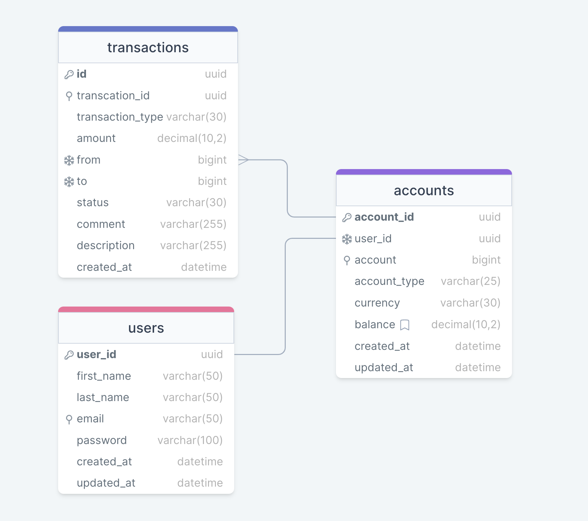

# demo-credit

A simple lending app with wallet functionality.


[](https://github.com/St-Pardon/demo-credit/commit)
[](https://github.com/St-Pardon/demo-credit/commit)
[](https://github.com/St-Pardon/demo-credit/license)

</div>

## Contents

- [About](#about)
- [Features](#features)
- [Purpose](#purpose)
- [Tools](#tools)
- [Getting Started](#getting-started)
  - [Prerequisites]()
  - [Set Up](#setup)
- [API Documentation](#api-documentation)
- [Deployment](#deployment)
- [Author(s)](#authors)
- [Licence](#license)

## About

Demo Credit is a mobile lending app that requires wallet functionality. This is needed as borrowers need a wallet to receive the loans they have been granted and also send the money for repayments.

## Features

- **Account Creation:** Users can `signup` and can create an account or multiple accounts of the same type or other types which includes a `savings` account, `current` account or a `fixed-deposit` account.
- **Fund Deposit:** Users can fund their various accounts.
- **Fund Transfer:** Users can transfer funds between their accounts and also to another user’s account.
- **Fund Withdrawal:** Users can withdraw funds from their account.
- **Transaction History:** Users can get a transaction history from each of their accounts or from all of their accounts. They can track `transaction status` for `pending`, `confirmed`, `failed` or `canceled` transaction.

## purpose

The purpose of this project is for both learning purpose especially with the [Knexjs](https://knexjs.org/) ORM and to fulfill the technical assessment requirement for the role of backend engineering at [Lendsqr](https://lendsqr.com/).

> Find full project reqirements [here](./tasks.md#tasks)

## Tools

The following tools were used in actualizing this project

- **IDE/Text editor:** Visual Code, VI
- **Source Control and Repository:** Git and Github
- **Language(s) and Framework(s):** TypeScript, Express, Node.
- **Libraries:** Knexjs, Passportjs, helmet, bcrypt and uuid.
- **Database:** MySQL
- **Testing:** Jest, Supertest, ThunderClient, Postman
- **Hosting:** AWS EC2, Ngnix and PM2 Server 
- **Others:** DrawSql, zsh terminal,

## Getting Started

To get started, follow the instructions below.

### Prerequisites

To run this project, the following tools must be installed on your machine:

- IDE/Text Editor: preferrably [VSCode](https://code.visualstudio.com/) but any other will surfice.
- Git: if not already installed, install from [here](https://git-scm.com/downloads)
- Terminal: for windows users, [Git Bash](https://git-scm.com/downloads) or [WSL](https://learn.microsoft.com/en-us/windows/wsl/install) will do. Mac or Linux will users any terminal will do.
- API Platform: Application, extention or web base API Platform will do. check out [Postman](https://www.postman.com/) and [ThunderClient](https://www.thunderclient.com/)
- MySQL: if not already installed, install from [here](https://www.mysql.com/)

### Set Up

**`Step 1:`** Open your terminal on your computer and clone the code [repository](https://github.com/St-Pardon/demo-credit.git).

```git
git clone https://github.com/St-Pardon/demo-credit.git
```
**`Step 2:`** Change into the cloned respository and list the content to make sure the content are intact.
```sh
cd demo-credit/
ls
...
```
**`Step 3:`** Install all dependencies from the [package.json](./package.json) file.
```sh
npm install
```
> This will install all packages needed for the application in the project directory, not globally.

**`Step 4:`** Start up your MySql database service and Setup your environmental variables by creating a `.env` file and inputing the neccessary variable.
```sh
mysql --version
touch .env
```
Open the `.env` file on you text editor and create the variables using the this [sampledotenv](./sampledotenv)
> To check if mysql is running on your computer, use the following applicable to your machine [windows](https://stackoverflow.com/questions/72204177/how-to-check-mysql-service-running-in-windows), [mac](https://discussions.apple.com/thread/756777) and [linux](https://linuxhint.com/how-to-find-out-if-mysql-is-running-on-linux-or-not/#:~:text=Use%20different%20methods%20to%20see,root%20%2Dp%20ping%E2%80%9D%20command.).

**`Step 5:`** Create the database and run migration.
```sh
npm run db:create
...
npm run db:migrate
... 
```
> NB: If the above code throws an error, be sure to open [db.config.ts](./src/config/db.config.ts) from [src/config](./src/config/) directory and manually input your database information as process.env do not run when the server is not running.

The command `db:migrate` will run the migration by creating all tables in the database using the table schma in the [src/migration](./src/migrations/) directory. It will implement the tables, constraints and relationships shown in this [E-R - Dirgrame](https://drawsql.app/teams/pardon/diagrams/demo-credit)


**`Step 6:`** Start the application
```bash
npm run start:dev
...
```

**`Step 7:`** Congratulation you have successfully started the application and now open your API Platform and test out the end points. To carefully expore and understand the endpoints see [API Documentation](#api-documentation) to get a list and demo of all the available endpoints and how to use them.
## API Documentation

The API Documentation is live on [Postman](https://documenter.getpostman.com/view/18352130/2s93sf2WNU). This contain the full list of the endpoints, their methods and some examples.

## Deployment

Site is live at [demo-credit](http://onu-onyedikachi-lendsqr-be-test.st-pardon.tech) 🚀🚀🚀

The application is running on an ec2 instance, run on node application server on localhost with pm2 for service set up and public with `Nginx` web server running the proxy pass.

## Author(s)

The people resonsible for bring this to live includes
<br/>
<a href = "https://github.com/Tanu-N-Prabhu/Python/graphs/contributors">

</a>

## License

Project source code is licensed under the [MIT](./LICENSE) license. You are free to fork this repository, edit the code, share and use it both for non-commercial and commercial purposes
